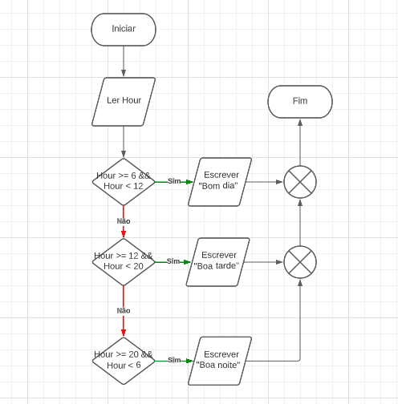

# Exercicio 1

A ambiguidade e a redundância são características das linguagens naturais.

# Exercicio 2

É uma sequência de instruções que devem ser exatamente seguidas passo a passo
para resolver um determinado problema.

# Exercicio 3

É uma representação gráfica de um algoritmo

# Exercicio 4

Pseudocódigo

# Exercicio 5

É uma sequência de instruções codificadas numa linguagem de programação.

# Exercicio 6

Apresenta um número aleatório entre 0 e 1

# Exercicio 7

Escreve 5 números aleatórios entre 1 e 50

# Exercicio 8

```csharp
using System;

namespace ConsoleApplication3
{

    class ProgramaExemplo
    {

        public static void Main (string [] args)
        {

            do
            {
                Console.Write("Introduza um número: ");
                var num = int.Parse(Console.ReadLine());
                if (num == 0)
                {
                    Console.WriteLine("O número é preciso ser superior a 0");
                    break;
                }
                else if (num % 2 == 0)
                {
                    Console.WriteLine("O número introduzido é par.");
                }
                else
                {
                    Console.WriteLine("O número introduzido é ímpar.");
                }
            } while (true);
        }
    }
}
```

# Exercicio 9

Soma todos os valores de uma array

# Exercicio 10

```csharp
using System;

namespace ConsoleApplication3
{
    
    class Programa2Exemplo
    {

        public static void Main(string[] args)
        {

            int num, tabuada;

            Console.Write("Introduza o número: ");

            num = int.Parse(Console.ReadLine());

            for (var i = 1; i <= 10; i++)
            {
                tabuada = num * 1;
                Console.WriteLine(tabuada);
            }

            Console.ReadLine();
        }
    }
}
```

# Exercicio 11

```csharp
using System;

namespace ConsoleApplication3
{
    
    class Programa2Exemplo
    {

        public static void Main(string[] args)
        {

            if (DateTime.Now.Hour >= 6 && DateTime.Now.Hour < 12)
            {
                Console.WriteLine("Bom dia");
            } else if (DateTime.Now.Hour >= 12 && DateTime.Now.Hour < 20)
            {
                Console.WriteLine("Boa tarde");
            } else if (DateTime.Now.Hour >= 20 && DateTime.Now.Hour < 6)
            {
                Console.WriteLine("Boa noite");
            }
        }
    }
}
```

